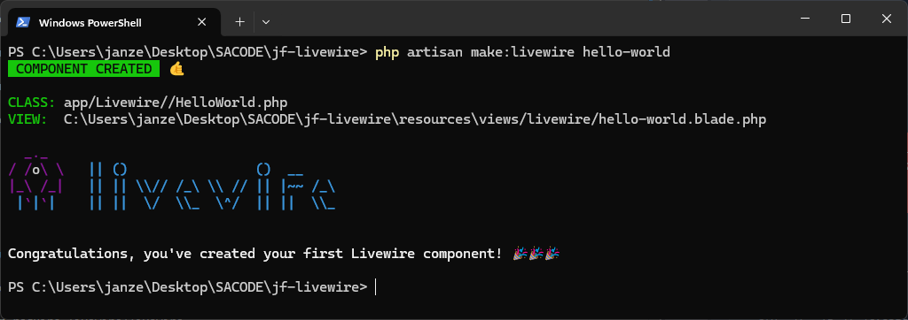

## JF Livewire Playgrounds

This repository I created for me to learning how to implement livewire on any types of projects.

## THE STEPS

### Preparing laravel project

You can use composer or with laravel installer

Here the commands for laravel installer installation

Make sure you install the installer using composer
```
composer global require laravel/installer
```
Then create your project using the installer

```
laravel new <projectname>
```


### Setup livewire packages

Using composer
```
composer require livewire/livewire
```

That's the only thing we need to setup include livewire on our laravel project

Find the installation guide here : https://livewire.laravel.com/screencast/getting_started/installation


#### Creating a livewire componen

```
php artisan make:livewire <componen-name>
```



creating layout 
```
php artisan livewire:layout
```